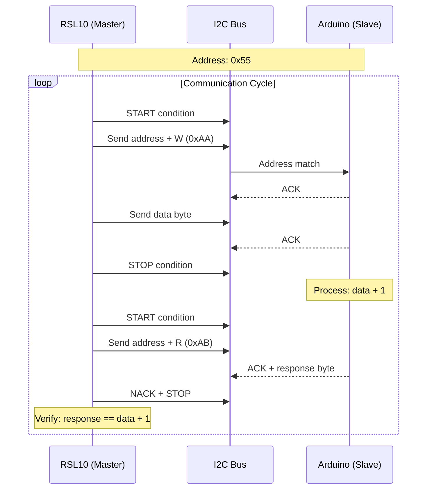

<div align="center">

# 🔌 RSL10-Arduino I2C Communication

[](https://en.wikipedia.org/wiki/C_(programming_language))
[](https://arduino.cc)
[](https://www.onsemi.com/products/wireless-connectivity/bluetooth-low-energy/rsl10)
[](LICENSE)

**Reliable bidirectional I2C communication between RSL10 (master) and Arduino (slave) using software I2C bit-bang implementation.**

*Embedded systems • Low-level protocols • 3.3V compatible • 90%+ success rate*

</div>

---

## 📋 Overview

This project implements reliable I2C communication between an **ON Semiconductor RSL10-002GEVB** (master) and **Arduino Nano** (slave). The RSL10 uses a software I2C bit-bang implementation, allowing flexible GPIO selection and reliable communication at 30-40 kHz.

### 🎯 Key Features

| Feature | Description |
|---------|-------------|
| **🔧 Software I2C** | Bit-bang implementation on RSL10 GPIO |
| **⚙️ Hardware I2C** | Native Wire library on Arduino |
| **↔️ Bidirectional** | Data transfer with acknowledgment |
| **⚡ 3.3V Logic** | Direct connection without level shifters |
| **🔄 Error Handling** | Retry logic and status codes |
| **✅ 90%+ Success** | Tested and verified reliability |

---

## 🏗️ System Architecture



---

## 🛠️ Hardware Requirements

### Components

| Component | Description | Quantity |
|-----------|-------------|:--------:|
| **RSL10-002GEVB** | ON Semiconductor dev board | 1 |
| **Arduino Nano** | 3.3V or 5V with level shifting | 1 |
| **Resistors** | 2.7kΩ for I2C pull-ups | 2 |
| **Jumper Wires** | Male-to-male | 4+ |
| **Breadboard** | For prototyping | 1 |

### Pin Connections

<div align="center">

| RSL10 Pin | Signal | Arduino Pin | Notes |
|:---------:|:------:|:-----------:|-------|
| **3.3V** | VCC | **3.3V** | ⚠️ Use 3.3V only |
| **GND** | Ground | **GND** | Common ground |
| **DIO2** | SDA | **A4** | + 2.7kΩ pull-up |
| **DIO3** | SCL | **A5** | + 2.7kΩ pull-up |

</div>

### Wiring Diagram

```
┌─────────────────────────────────────────────────────────────────┐
│                        I2C BUS WIRING                           │
├─────────────────────────────────────────────────────────────────┤
│                                                                 │
│    RSL10-002GEVB                         Arduino Nano           │
│    ┌──────────┐                          ┌──────────┐           │
│    │      3.3V├────────────────────────────┤3.3V      │           │
│    │          │                          │          │           │
│    │     DIO2 ├────┬───────────────────┬───┤A4 (SDA) │           │
│    │    (SDA) │    │                   │   │          │           │
│    │          │   ┌┴┐                  │   │          │           │
│    │          │   │ │ 2.7kΩ            │   │          │           │
│    │          │   └┬┘                  │   │          │           │
│    │          │    └───── 3.3V ────────┘   │          │           │
│    │          │                            │          │           │
│    │     DIO3 ├────┬───────────────────┬───┤A5 (SCL) │           │
│    │    (SCL) │    │                   │   │          │           │
│    │          │   ┌┴┐                  │   │          │           │
│    │          │   │ │ 2.7kΩ            │   │          │           │
│    │          │   └┬┘                  │   │          │           │
│    │          │    └───── 3.3V ────────┘   │          │           │
│    │          │                            │          │           │
│    │      GND ├────────────────────────────┤GND       │           │
│    └──────────┘                          └──────────┘           │
│                                                                 │
└─────────────────────────────────────────────────────────────────┘
```

---

## ⚠️ Logic Level Warning

> **🔴 CRITICAL: Voltage mismatch can damage RSL10!**
>
> | Configuration | Status |
> |---------------|:------:|
> | Arduino powered by RSL10 3.3V | ✅ Safe |
> | Arduino USB + RSL10 connected | ❌ Dangerous |
> | Using level shifter (3.3V ↔ 5V) | ✅ Safe |
> | 3.3V Arduino variant | ✅ Safe |

---

## 🚀 Quick Start

### 1️⃣ Clone Repository

```bash
git clone https://github.com/surbalo1/RSL10-Arduino-I2C-Communication.git
cd RSL10-Arduino-I2C-Communication
```

### 2️⃣ Upload Arduino Code

```bash
# Open arduino_slave/arduino_i2c_slave.ino in Arduino IDE
# Select: Tools > Board > Arduino Nano
# Select: Tools > Port > (your port)
# Click Upload
# Disconnect USB after upload
```

### 3️⃣ Setup RSL10 Project

1. Import `rsl10_master` into Eclipse IDE
2. Build the project
3. Flash to RSL10 using J-Link

### 4️⃣ Wire Hardware

Follow the wiring diagram above with pull-up resistors.

### 5️⃣ Monitor Output

**RSL10 (SEGGER RTT Viewer):**
```
TX: 0x00 ✓ | RX: 0x01 ✓
[1] TX: 0x01 ✓ | RX: 0x02 ✓
--- Stats: Success=10, Fail=0 ---
```

**Arduino (Serial Monitor @ 115200):**
```
Listening on 0x55
RX: 0x00 (0)
TX: 0x01
```

---

## 📁 Project Structure

```
RSL10-Arduino-I2C-Communication/
├── 📄 README.md              # Documentation
├── 📄 LICENSE                # MIT License
│
├── 📁 rsl10_master/          # RSL10 firmware
│   ├── include/              # Header files
│   │   └── i2c_hal.h         # I2C driver interface
│   └── source/               # Source files
│       ├── main.c            # Main application
│       └── i2c_hal.c         # Software I2C implementation
│
├── 📁 arduino_slave/         # Arduino firmware
│   └── arduino_i2c_slave.ino # I2C slave implementation
│
└── 📁 docs/                  # Additional documentation
    ├── wiring_guide.md       # Detailed wiring instructions
    └── troubleshooting.md    # Common issues & solutions
```

---

## ⚙️ How It Works

### Communication Flow

1. **RSL10 (Master)** sends a byte to Arduino at address `0x55`
2. **Arduino (Slave)** increments the byte and stores response
3. **RSL10** reads back the response
4. **RSL10** verifies: `response == original + 1`

### Technical Details

| Parameter | Value |
|-----------|-------|
| **Slave Address** | `0x55` |
| **I2C Speed** | ~30-40 kHz |
| **Implementation** | Software bit-bang (RSL10) |
| **Read/Write Delay** | 100ms recommended |

---

## 📊 Performance

| Metric | Value |
|--------|-------|
| **I2C Clock** | 30-40 kHz |
| **Success Rate** | 90%+ after initial sync |
| **Recommended Delay** | 100ms between transactions |
| **Wire Length** | <20cm recommended |

---

## 🔧 Configuration

### Adjust I2C Speed

In `i2c_hal.c`:
```c
#define I2C_DELAY 250  // Higher = slower, more reliable
```

### Change Slave Address

| File | Line |
|------|------|
| Arduino | `#define SLAVE_ADDRESS 0x55` |
| RSL10 | `#define ARDUINO_ADDR 0x55` |

---

## 🛠️ Development Environment

| Tool | Purpose |
|------|---------|
| **Eclipse IDE** | RSL10 development |
| **RSL10 SDK** | ON Semiconductor libraries |
| **J-Link** | Debugging & flashing |
| **SEGGER RTT** | Debug output |
| **Arduino IDE** | Arduino programming |

---

## 🐛 Troubleshooting

| Issue | Solution |
|-------|----------|
| No communication | Check wiring, pull-ups, common ground |
| Intermittent failures | Increase `I2C_DELAY`, shorten wires |
| NACK on all addresses | Verify slave address matches |
| Noisy signal | Add 100nF capacitor near Arduino |

---

## 📄 License

MIT License - see [LICENSE](LICENSE) file.

---

## 🙏 Acknowledgments

- ON Semiconductor RSL10 SDK
- Arduino Wire library
- Open-source I2C community

---

<div align="center">

**Built with ⚡ for embedded systems enthusiasts**

[](https://github.com/surbalo1/RSL10-Arduino-I2C-Communication)

</div>
